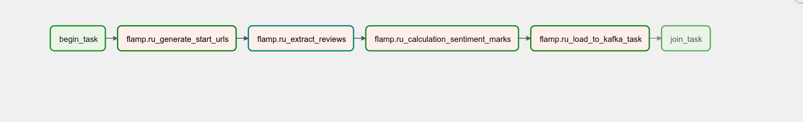

# Извлечение отзывов о компании

Извлечение отзывов реализовано при помощии описанных ранее библиотеки scrapy и оркестратора задач airflow.

Конвеер данных представлен направленным ациклическим графом:



**Описание:**

1. fkam.ru_generate_start_urls - генерирование на основе карты сайта ссылок с отзывами нужной компании для извлечения отзывов со страниц. Результатом данной задачи является список ссылок.
2. flamp.ru_extract_reviews - извлечение отзывов следующего формата:

```json
{
    "review_url": "https://barnaul.flamp.ru/firm kfc_set_restoranov_bystrogo_obsluzhivaniya-70000001029350873/otzyv-7639376",
    "author": "\n\t\tmaksimsup97\n\t",
    "review_date": "\n\t\t",
    "text_data": "<p class=\"t-rich-text__p\">\n\t\t\t\t\t\t\u0412\u0437\u044f\u043b \u043a\u043e\u0444\u0435, \u043d\u0430\u043b\u0438\u0442\u043e \u043f\u043e\u043b \u0441\u0442\u0430\u043a\u0430\u043d\u0430, \u043f\u0435\u043d\u043a\u0438 \u043f\u043e\u0447\u0442\u0438 \u043d\u0435\u0442, \u0441\u0430\u043c \u043a\u043e\u0444\u0435 \u0432\u043e\u0434\u044f\u043d\u0438\u0441\u0442\u044b\u0439. \u0417\u0430\u043a\u0430\u0437 \u0436\u0434\u0430\u043b \u043f\u043e\u0447\u0442\u0438 5 \u043c\u0438\u043d\u0443\u0442, \u043d\u0430\u0432\u0435\u0440\u043d\u043e\u0435 \u0433\u043e\u0442\u043e\u0432\u0438\u043b\u0430\u0441\u044c \u043a\u0430\u0440\u0442\u043e\u0448\u043a\u0430 \u0444\u0440\u0438, \u043f\u043e\u0442\u043e\u043c\u0443 \u0447\u0442\u043e \u043e\u043d\u0430 \u0431\u044b\u043b\u0430 \u0433\u043e\u0440\u044f\u0447\u0430\u044f.\n\t\t\t\t\t</p>"}
```
3. flamp.ru_calculation_sentiment_marks - подсчёт тональных оценок отзывов приведенных выше.

Результатом оценки является следующее:

```json
{
    "review_url": "https://barnaul.flamp.ru/firm/kfc_set_restoranov_bystrogo_obsluzhivaniya-70000001029350873/otzyv-7639376",
    "author": "\n\t\tmaksimsup97\n\t",
    "review_date": "\n\t\t",
    "text_data": "<p class=\"t-rich-text__p\">\n\t\t\t\t\t\t\u0412\u0437\u044f\u043b \u043a\u043e\u0444\u0435, \u043d\u0430\u043b\u0438\u0442\u043e \u043f\u043e\u043b \u0441\u0442\u0430\u043a\u0430\u043d\u0430, \u043f\u0435\u043d\u043a\u0438 \u043f\u043e\u0447\u0442\u0438 \u043d\u0435\u0442, \u0441\u0430\u043c \u043a\u043e\u0444\u0435 \u0432\u043e\u0434\u044f\u043d\u0438\u0441\u0442\u044b\u0439. \u0417\u0430\u043a\u0430\u0437 \u0436\u0434\u0430\u043b \u043f\u043e\u0447\u0442\u0438 5 \u043c\u0438\u043d\u0443\u0442, \u043d\u0430\u0432\u0435\u0440\u043d\u043e\u0435 \u0433\u043e\u0442\u043e\u0432\u0438\u043b\u0430\u0441\u044c \u043a\u0430\u0440\u0442\u043e\u0448\u043a\u0430 \u0444\u0440\u0438, \u043f\u043e\u0442\u043e\u043c\u0443 \u0447\u0442\u043e \u043e\u043d\u0430 \u0431\u044b\u043b\u0430 \u0433\u043e\u0440\u044f\u0447\u0430\u044f.\n\t\t\t\t\t</p>", "neutral": 0.348655104637146,
    "negative": 0.38492217659950256,
    "positive": 0}
```

Расчёт оценок происходит при помощи нейронной модели "dostoevskiy" (https://pypi.org/project/dostoevsky/).

4. flamp.ru_load_to_kafka - загрузка данных в Кафку.


5. [Небольшой иллюстративный пример визуализации обработанных данных](visualization.ipynb)

