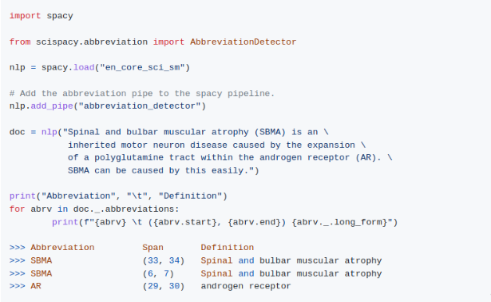
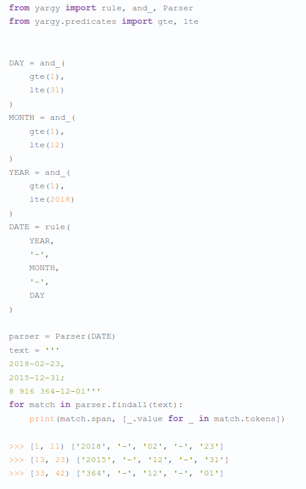

# Извлечение медицинских текстов из неструктурированных данных (NLP)

Каждая медицинская организация использует собственную систему электронных медицинских карт для ведения записей пациентов. Методы обработки естественного языка (NLP) используются для анализа этих записей и получения структурированных данных из неструктурированных.
 В области медицины присутствует интересующая нас информация - симптомы, диагноз, названия лекарств и т. д.

Можно систематизировать прошлые заметки, извлечь из них неких определенный опыт, знания на основе которых, можно улучшить качество лечения . В этом случае можно применить НЛП к неструктурированным данным и получить полезную информацию из заметок пациента.
Моя профессия связана с извлечением, обработкой больших объёмов информации и применением различных алгоритмов (Дата инжиниринг) на языке программирования python. Ниже я рассмотрю ряд готовый решений (технологий), подходящий по моему мнению к задаче извлечения данных и их структуризации.

## Spark NLP

Spark NLP был основан John Snow Labs и построен на основе Apache Spark 2.4.4. Он предоставляет простой API для интеграции с вашим приложением. Чтобы использовать этот API, вы должны знать языки программирования Python (или Java).
Библиотека охватывает многие распространенные задачи НЛП, включая токенизацию, создание стемминга, лемматизацию, тегирование частей речи, анализ тональности, проверку орфографии, распознавание именованных объектов и т. д.

**Плюсы библиотеки, полезность для медицины:**

Spark NLP обеспечивает распознавание клинических сущностей, нормализацию сущностей, извлечение взаимосвязей медицинских данных и определение состояния утверждений. Другая важная вещь заключается в том, что можно использовать пятьдесят видов предварительно обученных моделей здравоохранения, которые могут распознавать клинические симптомы, название и силу дозы, анатомию, имя и возраст пациента.

**Минусы:**

Библиотека которая содержит медицинские модели платная, плохая поддержка русского языка.
Библиотека также содержит open source решение.

**Ccылки:** 

https://github.com/johnsnowlabs/spark-nlp

## Scispacy

ScispaCy — это пакет Python, содержащий модели spaCy для обработки биомедицинских, научных или клинических текстов.

Эта библиотека содержит pipeline’ы обработки данных и модели, связанные с использованием spaCy для научных документов. В частности, существует специальный токенизатор, который добавляет правила токенизации поверх токенизатора spaCy на основе правил, POS-теггер и синтаксический анализатор, обученный на биомедицинских данных, и модель обнаружения диапазона объектов. Отдельно есть и модели NER (распознавание именованных сущностей) для более специфических задач.

Пример (распознавание биомедицинский аббревиатур):

**Плюсы:** open source решение, есть готовые модели, хороший функционал библиотеки

**Минусы:** всё заточено под английский язык, необходимы свои русскоязычные датасеты и «дрессировка» нейронных моделей.

**Ссылки:** 

https://allenai.github.io/scispacy/

https://github.com/allenai/scispacy

## Natasha

Задача NER традиционна и хорошо изучена, особенно для английского языка. Существует большое количество как коммерческих так и открытых решений, например, NLTK, Spacy, Stanford NER, OpenNLP и другие. Для русского языка тоже существует довольно много инструментов, но почти все они являются коммерческими (DaData, Pullenti, Abbyy Infoextractor, Dictum).

Из открытых инструментов отметим Natasha ­– открытая библиотека (набор библиотек) для языка программирования Python, которая позволяет извлекать структурированную информацию из текстов на русском языке. Natasha отличается лаконичным интерфейсом и включает экстракторы для имён, адресов, сумм денег, дат и некоторых других сущностей.
«Наташа», это, похоже, один из главных проектов NLP для русского языка.

Он имеет долгую историю, и начинался с rule based решения, которое развивалось через популярный Yargy Parser, и сейчас решает основные задачи NLP для русского языка: токенизацию, сегментация предложения, лемматизация, нормализация фразы, синтаксический разбор, NER-тегирование, извлечение фактов.

По умолчанию редко хватает встроенных возможностей Наташи и приходится спускаться на уровень ниже (yargy-парсер).  Правила для извлечения сущностей описываются с помощью контекстно-свободных грамматик и словарей.
Грамматики в Yargy записываются на специальном DSL-е. Так, например, будет выглядеть простое правило для извлечения дат в ISO-формат.
Пример грамматики Дат:

**Достоинства и недостатки:**

Natasha предоставляет под лицензией MIT решения, которых раньше не было в открытом доступе (или я о них не знаю). Например, раньше нельзя было просто взять и извлечь структурированные имена и адреса из русскоязычного текста, а теперь можно. Раньше для Python не было чего-то вроде Томита-парсера, теперь есть.

**Постараюсь коротко сформулировать недостатки:**

Вручную составленные правила.
Natasha разбирает только те словосочетания, для которых заранее были составлены правила. Может показаться, что нереально написать правила, например, для имён в произвольном тексте, слишком они разные. На практике всё не так плохо:

Если посидеть недельку, то всё-таки для 80% имён составить правила можно.
Обычно нужно работать не с произвольными текстами, а с текстами на контролируемом естественном языке: резюме, решения судов, нормативные акты, раздел сайта с контактами, истории болезеней.

В правилах для Yargy-парсера можно использовать разметку, полученную методами машинного обучения.
Медленная скорость работы.

Ошибки в стандартных правилах.
Например, качество извлечения имён у Natasha очень далеко от SOTA. На практике из коробки библиотека не всегда показывает хорошее качество, нужно дорабатывать правила под себя.

**Ссылки:** 

https://github.com/orgs/natasha/repositories, 

https://github.com/ezhkovskii/graduate_work_nlp_in_ehr

**Личные комментарии:** По моему личному мнению эту библиотеку стоит использовать (попробовать), описать свои правила КС-грамматик и научить, отладить на множестве текстов. Т.к. Наташа это набор библиотек для обработки текстов на русском языке, у него есть довольно хороший потенциал.  Проект подрос, библиотека теперь решает все базовые задачи обработки естественного русского языка: сегментация на токены и предложения, морфологический и синтаксический анализ, лемматизация, извлечение именованных сущностей. 

Кроме того, нашёл выпускную квалификационную работу по данной тематике (анализ и структурирование медицинских текстов на примере эпикризов для повышения эффективности обработки неструктурированных и слабоструктурированных данных.), советую посмотреть, мне она показалась очень интересной и полезной, в ней используется Наташа, что ещё более глубоко подчеркивает её ценность как технологии в контексте данной задачи. 

# Извлечение данных

Данные могут содержаться в различной форме и в различных источниках. Опираясь на мой опыт хотел бы посоветовать соответствующий стек технологии для добычи (mining) и обработки данных (processing).

## Scrapy

Scrapy – это бесплатный фреймворк для веб-краулинга находящийся в открытом доступе, который написан на языке программирования Python. Изначально задумывался для веб-скрейпинга, однако также может использоваться для извлечения информации используя API или же как веб краулер общего применения. Это Django в мире скрапинга, инструмент в котором есть практически всё для организации автоматизированного извлечения информации с различных веб-ресурсов (сайтов). Хорошая документация, хорошее комьюнити, проект open source.
Подходит для задач когда необходимо извлечь данные (текст, числа, неважно что, при помощи регулярных выражений, различных парсеров html текста) с сайтов у которого нет публичного api. Можно организовать несложные конвейеры обработки данных.

## Airflow

Apache Airflow — открытое программное обеспечение для создания, выполнения, мониторинга и оркестровки потоков операций по обработке данных.

Apache AirFlow — это open-source инструмент, который позволяет разрабатывать, планировать и осуществлять мониторинг сложных рабочих процессов. Главной особенностью является то, что для описания процессов используется язык программирования Python. Airflow используется как планировщик ETL/ELT-процессов.

Большинство процессов обработки данных строятся на определении набора «задач» для извлечения, анализа, преобразования, загрузки и хранения данных. Например, последовательность обработки данных может состоять из таких задач, как чтение логов из S3, создание задания Spark для извлечения соответствующих объектов, индексирование объектов с помощью Solr и обновление существующего индекса для расширения поиска. Чтобы автоматизировать процесс и запускать его еженедельно, вы можете использовать планировщик времени, например Cron, определяя рабочие процессы в Crontab. Это действительно отлично подходит для простых рабочих процессов, но все становится хуже, когда вы начинаете поддерживать рабочий процесс в крупных проектах, где между элементами существуют зависимости. Еще это усложняется, если вы ждете каких-то входных данных от сторонних разработчиков, или другие команды не могут начать свою работу, пока не завершатся ваши задачи.

Резюмируя, данный инструмент как нельзя кстати подходит для организации извлечения данных откуда угодно (можно расширить билиотеками python , тот же scrapy) обработки и сохранения в централизованное хранилище для дальнейшего анализа при помощи средств визуализации, мониторинга, обучения на этих данных.

## Хранилища данных

Большие объёмы информации необходимо хранить централизованно. В этом больше всего подходит Clickhouse (для датасетов), Elasticsearch (это поисковый и аналитический движок, с помощью которого ваша команда может быстро искать информацию в любых типах данных и анализировать их), Greenplum (мощный и гибкий инструмент для аналитической обработки больших объёмов данных.). 

Это лишь небольшой пример технологического стека для хранения большого объёма данных (big data), который успешно применяется во многих проектах (к примеру, сети лабораторий «Центр молекулярной диагностики» (CMD), ИТ-компании «Инфотех-Групп», Альфа-банк и др.)

## Инструменты визуализация

Хочу посоветовать веб-фрейворк на языке python для создания интерактивных аналитических приложений Dash.

Dash является довольно интересным Веб-фреймворком для визуализации данных и имеет в семе довольно много полезных функций в сочетании с простотой их применения. Сам Dash это некий коллаб HTML, React. Js, Flask и CSS и предоставляет python классы для всех своих визуальных компонентов.

Его используют ученые и аналитики для отображения различного рода информации (графики, 3-д модели, математические модели, модели машинного обучения и т.д.). Довольно прост в освоении, на разработку затрачивается минимум усилий. Очень много готовых компонентнов, open source решение.

**Ссылки:**

https://dash.plotly.com/ 

# Краткое резюме

В рамках поставленной задачи «Извлечение датасетов из текстов» мною сделан вывод, что написание собственного «извлекателя» датасетов из неструктурированного текста довольная сложная задача, требующая специфических навыков и большого количества времени. Тем более, существует большое количество хороших решений (рассмотрены ранее наиболее достойные из них). Решения по большей части основаны на NLP и ML подходах и для русскоязычного сегмента в медицине мало что есть, готового попросту нет. Наиболее понравившиеся решение для извлечения сущностей (болезни, признаки болезни, назначенное решение и т.д.) это набор русскоязычных библиотек Natasha. В данном случае я считаю хорошей идей собрать команду python-программистов и попробовать реализовать своё решение для «извлекателя» датасетов клинических заболеваний(данных) на основе этого решения.

Также для централизованной организации хранения датасетов рекомендую использовать вышеперечисленные стек технологий, организовать платформу ETL/ELT процессов для извлечения, обработки и накопления данных из различных источников (json,csv, web-sites, api, ,базы данных, внешние приборы сбора данных и др,). В дальнейшей перспективе накопленных данные будут стоить «очень дорого» с точки зрения полезности. Они будут структурированы и понятны. Этой работой занимаются дата инженеры (python разработчики).
